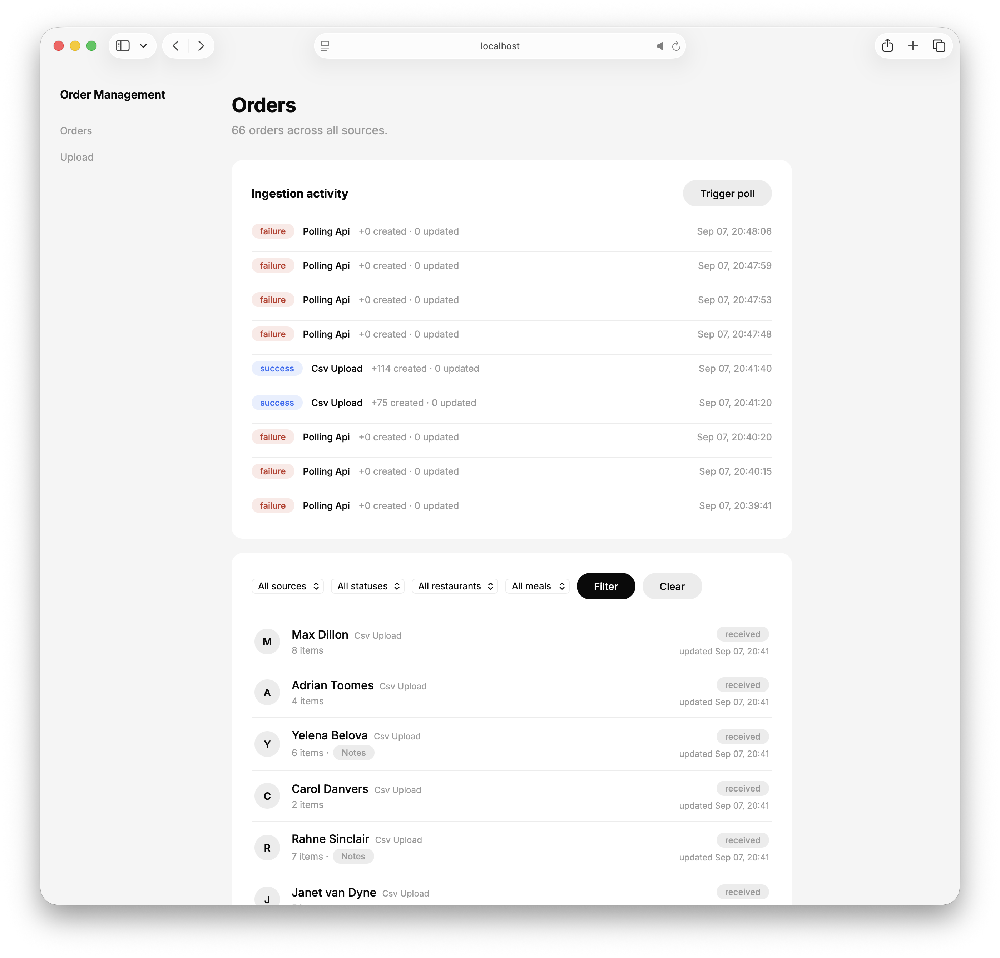
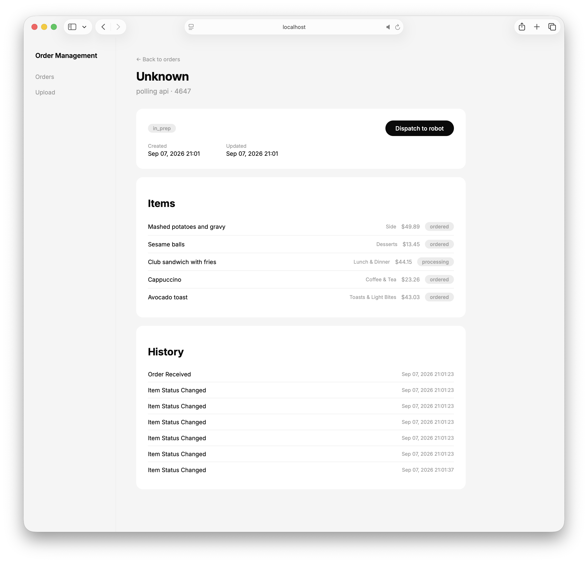
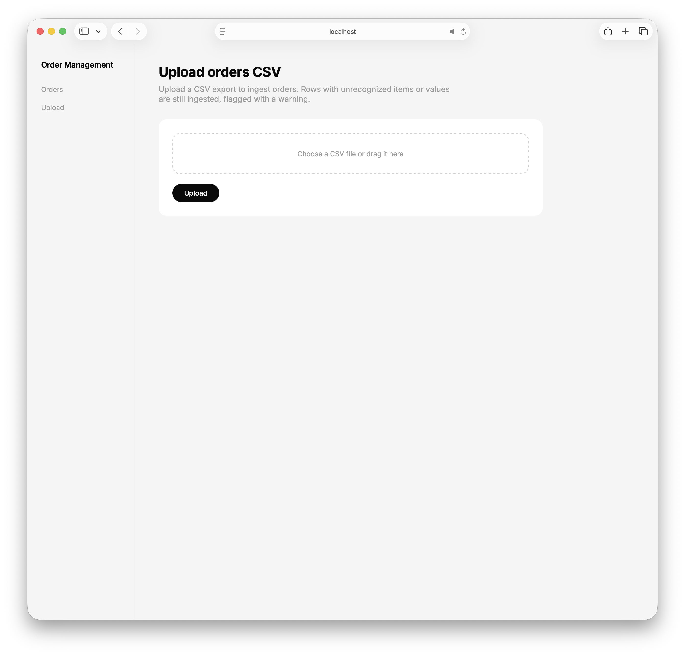

# Order Management System

An order ingestion + management system that merges orders from three parallel sources —
webhook, polling API, and CSV upload — tracks status and per-order history, and skeletons a
dispatch payload for a downstream robotic assembly system. See
`docs/plans/mvp-order-management-plan.md` for the full design.

## TL;DR

This build assumes you're running a vanilla MacBook, so the stack is simply Python/HTML/JS and SQLite to make sharing easy.

You can get the app fully installed (so long as UV is available) via `make install` and then start it up with `make run` to see the dashboard running at `http://localhost:8000`. 

Or, if you'd like to see a demo, you can start everything up with `make run-all`: This demos the system as it would run in real life by mocking orders created from `specs/api_responses.jsonl` one line at a time. Each poll by the API replays an order from the spec as though the order was created via the webhook pipeline.



Click on an order to see the full details and to optionally dispatch the order to the robot. Orders are not dispatched to the robot automatically: only when the "Dispatch to robot" button is pressed is the payload sent. 

The dispatch payload sent to the robot looks like this:

```json
{
  "order_id": "bd679691-d3d7-4dc7-9d57-5879a3b6d8a1",
  "source": "csv_upload",
  "restaurant": "Tasty Burger",
  "meal": "breakfast",
  "requested_for": "today",
  "items": [
    { "name": "Ciabatta rolls", "category": "bakery", "quantity": 1 },
    { "name": "Beef chow fun", "category": "entree", "quantity": 1 }
  ],
  "dispatched_at": "2026-09-07T20:41:59.751513Z"
}
```

`requested_for` is `null` for orders that don't carry a "for tomorrow" flag (webhook and polling
orders); `restaurant`/`meal` are `null` for polling-sourced orders, which don't carry those
fields. This same payload is what gets stored as the `ORDER_DISPATCHED` event's detail in the
order's history.



You can upload order CSVs at `http://localhost:8000/upload`



### Next steps

1) There's no authentication whatsoever. Presumably there would be different users/roles that could be used to close-down the app. 
2) For this MVP system, we're just using SQLite for the backend database. I'd use PostgreSQL or another more production-ready database for actual real-world use. 
3) Costs are in floats, but since those aren't accurate enough when it comes to rounding pennies, I'd switch that to use a money data-type that stores data to precisely two decimal points. 
4) There's no pagination of the dashboard order list which would certainly be nice as orders grow in volume.
5) I've only added filters in the order list for the `source` of an order, its `status`, the `restaurant` and `meal` type: it might be nice to filter by specific order items, too. 
6) The design is very MVP and grey-scale. It could definitely use some more visual appeal! 

## Quickstart

A `Makefile` at the repo root wraps everything below. From the repo root:

```bash
make install    # uv sync
make run-all    # main app on :8000 + mock polling upstream on :8001, Ctrl+C stops both
make mock-all   # in another terminal: replay webhook orders, trigger a poll, upload a CSV
make test       # pytest
```

Then open `http://localhost:8000`. Run `make help` for the full target list (`run`/`run-mock`
individually, `typecheck`, `check`, `clean`, and each mock-data target on its own). The rest of
this document explains what those targets do and how to run the equivalent commands by hand.

## 1. Install

Requires Python 3.12+. Dependencies are managed with [`uv`](https://docs.astral.sh/uv/); if you
don't have it:

```bash
curl -LsSf https://astral.sh/uv/install.sh | sh
```

Then, from `app/`:

```bash
cd app
uv sync
```

This creates `app/.venv` and installs everything in `pyproject.toml` (FastAPI, SQLModel,
Jinja2, httpx, etc., plus the `pytest`/`mypy` dev group).

## 2. Start

The system is two independent processes: the main app, and (optionally) the mock polling
upstream it polls against.

```bash
# from app/
uv run uvicorn app.main:app --reload
```

The app boots on `http://localhost:8000`, creates its SQLite database
(`app/order_management.db`, WAL mode) on first run, and starts an in-process poller that
targets `http://localhost:8001` every 30 seconds by default. If nothing is listening there yet,
poll attempts will just fail and retry with backoff — harmless, but if you want the polling
pipeline to actually do something, also run the mock upstream in a second terminal:

```bash
# from app/, in a second terminal
uv run uvicorn mock_upstream.app:app --port 8001
```

Configuration is via environment variables (prefix `ORDER_MGMT_`, or an `app/.env` file):

| Variable | Default | Purpose |
|---|---|---|
| `ORDER_MGMT_DATABASE_URL` | `sqlite:///app/order_management.db` | SQLite connection string |
| `ORDER_MGMT_POLLING_ENABLED` | `true` | Run the in-process background poller |
| `ORDER_MGMT_POLLING_API_BASE_URL` | `http://localhost:8001` | Where the poller looks for `/poll` |
| `ORDER_MGMT_POLLING_INTERVAL_SECONDS` | `30.0` | Delay between successful polls |
| `ORDER_MGMT_POLLING_BACKOFF_INITIAL_SECONDS` | `5.0` | Backoff start on poll failure |
| `ORDER_MGMT_POLLING_BACKOFF_MAX_SECONDS` | `300.0` | Backoff cap |

To verify everything's up: `curl http://localhost:8000/health` should return `{"status": "ok"}`.

Shortcut: `make run` starts just the main app; `make run-mock` starts just the mock upstream;
`make run-all` starts both together from the repo root (Ctrl+C stops both).

## 3. Use

**Dashboard** — `http://localhost:8000/` — a filterable table of every ingested order
(filter by source/status/restaurant/meal) plus an ingestion-activity panel showing recent
webhook/poll/CSV runs, with a "Trigger poll" button to force an immediate poll cycle.

**Order detail** — click any row, or go to `http://localhost:8000/orders/{id}/view` — current
fields, items (with category/price/status where the polling pipeline populated them), and the
full event/history timeline. A "Dispatch to robot" button appears once the order has ≥1 item and
isn't already `dispatched`/`cancelled`.

**CSV upload** — `http://localhost:8000/upload` — pick a file, submit, and see a per-file summary
(rows ingested, rows with warnings) rather than a bare success/fail.

**JSON API** (interactive docs at `http://localhost:8000/docs`):

| Method | Path | Purpose |
|---|---|---|
| `POST` | `/ingest/webhook/orders` | Webhook receiver |
| `POST` | `/ingest/poll/trigger` | Force an immediate poll cycle |
| `POST` | `/ingest/csv` | CSV file upload (multipart) |
| `GET` | `/orders` | List orders — filter by `source`, `order_status`, `restaurant`, `meal`; paginated |
| `GET` | `/orders/{id}` | Order detail, including current items |
| `GET` | `/orders/{id}/events` | Order event/history timeline |
| `POST` | `/orders/{id}/dispatch` | Transition to `dispatched`, return the robot dispatch payload |
| `GET` | `/ingestion/runs` | Recent ingestion run log (per pipeline) |

**Uploading a CSV via the API** — `POST /ingest/csv` takes a multipart file upload (field name
`file`):

```bash
curl -F "file=@../specs/orders_4.csv" http://localhost:8000/ingest/csv
```

The response is a per-file summary (rows ingested vs. rows ingested-with-a-warning) rather than a
bare success/fail — a row with an unrecognized `items` token, `meal`, or `tomorrow` value still
gets ingested (raw text preserved) instead of failing the whole upload.

**Filtering orders via the API** — `GET /orders` accepts `source`, `order_status`, `restaurant`,
and `meal` as query params (all optional, combinable, and paginated via `offset`/`limit`):

```bash
# All orders from a specific restaurant
curl "http://localhost:8000/orders?restaurant=Tasty%20Burger"

# Delivered orders that came in via CSV upload
curl "http://localhost:8000/orders?source=csv_upload&order_status=delivered"

# Dinner orders, second page of 25
curl "http://localhost:8000/orders?meal=dinner&offset=25&limit=25"
```

Omit a param entirely to leave that dimension unfiltered — `source`/`order_status`/`meal` must
either be omitted or match one of the enum values in `/docs`; an empty value (e.g. `meal=`) is
treated the same as omitting it, matching the "All ..." option in the dashboard's filter form.

**Running the tests / type checker** (from `app/`):

```bash
uv run pytest
uv run mypy --strict app tests
```

Shortcut, from the repo root: `make test`, `make typecheck`, or `make check` for both.

## Adding mock orders

The system starts out empty — there's no seed data, so you'll want to inject orders to see it
do anything. All three ingestion pipelines have a mock/injection mechanism built for exactly
this, driven off the real sample files in `specs/`. With the app running on `:8000` (§2 above),
from `app/`:

**Webhook** — replay `specs/webhook_orders.jsonl` against the live endpoint:

```bash
uv run python scripts/replay_webhook.py
```

Useful flags: `--delay 0.05` (sleep between requests, to simulate bursty real-time traffic),
`--limit 50` (only replay the first N lines), `--base-url` (target a different running
instance), `--file` (replay a different file with the same shape — handy for hand-written
synthetic orders). Re-running it is safe: redelivered `order_id`s upsert instead of duplicating,
so it also doubles as a demo of that idempotency.

Shortcut, from the repo root: `make mock-webhook` (pass flags through with
`make mock-webhook ARGS="--delay 0.05 --limit 50"`).

**Polling API** — run the mock upstream (§2 above) alongside the main app pointed at it
(`ORDER_MGMT_POLLING_API_BASE_URL=http://localhost:8001`, the default). It replays
`specs/api_responses.jsonl` one line per call. Then either:

- wait for the background scheduler (polls automatically every 30s by default), or
- force it immediately: `curl -X POST http://localhost:8000/ingest/poll/trigger`

`curl -X POST http://localhost:8001/reset` rewinds the mock upstream's cursor back to the start
of the file if you want to replay it again.

Shortcut, from the repo root: `make mock-poll` (force a poll cycle) and `make mock-reset`
(rewind the mock upstream's cursor).

**CSV upload** — through the browser at `http://localhost:8000/upload`, or:

```bash
curl -F "file=@../specs/orders_4.csv" http://localhost:8000/ingest/csv
```

`orders_4.csv` is the full 267-row corpus (a cumulative superset of `orders_1..3.csv`), so it's
the one to use for the most data in one shot.

Shortcut, from the repo root: `make mock-csv`.

All three can be run concurrently against the same live app to see orders from every source
merge into one order list at once. `make mock-all` runs all three at once.
